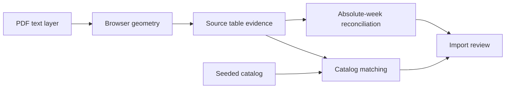

### Goal

Make this PDF import produce correctly separated exercise rows and sequential program weeks, resolve every valid catalog movement automatically, and preserve genuinely absent RPE targets as non-blocking source-faithful warnings.

### Approach

Use the selected source-first design rather than teaching catalog matching to accept malformed concatenations. First reproduce the problematic page geometry with small coordinate fixtures and repair row reconstruction; then reconcile phase-local week numbers against ordered chunk ranges only where the mapping is deterministic. Finally classify the corrected movement names as existing aliases versus genuinely missing exercises and update the idempotent catalog seed.

### Current implementation findings

- [pdfText.ts](air-file://hr6an1v8utsqe8dv3q4m/D:/App/WorkoutApp/web/src/lib/pdfText.ts?type=file&root=C%3A) reconstructs text locally and sends only text, while [pdfHeaderColumns.ts](air-file://hr6an1v8utsqe8dv3q4m/D:/App/WorkoutApp/web/src/lib/pdfHeaderColumns.ts?type=file&root=C%3A) assigns pieces to detected table columns. The concatenated names in the 27 mapping rows are upstream source-row reconstruction failures, not safe aliases.
- [ImportTableEvidence.cs](air-file://hr6an1v8utsqe8dv3q4m/D:/App/WorkoutApp/api/Services/ImportTableEvidence.cs?type=file&root=C%3A) already applies uniquely matched source rows, replaces model exercise names with authoritative row names, expands working-set counts, and converts explicit RIR to RPE. This behavior should be extended conservatively, not bypassed.
- [ImportChunkReconciliation.cs](air-file://hr6an1v8utsqe8dv3q4m/D:/App/WorkoutApp/api/Services/ImportChunkReconciliation.cs?type=file&root=C%3A) currently reports days outside a chunk’s absolute week range but does not translate a phase-local week sequence into that range.
- [ImportValidation.cs](air-file://hr6an1v8utsqe8dv3q4m/D:/App/WorkoutApp/api/Services/ImportValidation.cs?type=file&root=C%3A) correctly enforces seven days per absolute week. The reported 43-day overflow is therefore evidence that multiple phases retained local week labels, not a reason to loosen or phase-scope the stored-program limit.
- [CatalogSeed.cs](air-file://hr6an1v8utsqe8dv3q4m/D:/App/WorkoutApp/api/Services/CatalogSeed.cs?type=file&root=C%3A) upserts by slug and replaces aliases transactionally. [exercises.json](air-file://hr6an1v8utsqe8dv3q4m/D:/App/WorkoutApp/deploy/exercises.json?type=file&root=C%3A) is the authoritative global library.
- The RPE issue is intentionally a warning in [ImportValidation.cs](air-file://hr6an1v8utsqe8dv3q4m/D:/App/WorkoutApp/api/Services/ImportValidation.cs?type=file&root=C%3A). Explicit table RPE/RIR should be recovered, but source-silent sets must remain unspecified.

### File changes

#### Modify

- [pdfGeometry.ts](air-file://hr6an1v8utsqe8dv3q4m/D:/App/WorkoutApp/web/src/lib/pdfGeometry.ts?type=file&root=C%3A) — refine baseline/row grouping for the PDF’s tightly spaced and transformed table text so neighboring exercise rows cannot collapse into one row.
- [pdfHeaderColumns.ts](air-file://hr6an1v8utsqe8dv3q4m/D:/App/WorkoutApp/web/src/lib/pdfHeaderColumns.ts?type=file&root=C%3A) — preserve one exercise cell per reconstructed source row while retaining existing multi-line header and column-boundary behavior.
- [pdfGeometry.test.ts](air-file://hr6an1v8utsqe8dv3q4m/D:/App/WorkoutApp/web/src/lib/pdfGeometry.test.ts?type=file&root=C%3A), [pdfHeaderColumns.test.ts](air-file://hr6an1v8utsqe8dv3q4m/D:/App/WorkoutApp/web/src/lib/pdfHeaderColumns.test.ts?type=file&root=C%3A), and [pdfText.test.ts](air-file://hr6an1v8utsqe8dv3q4m/D:/App/WorkoutApp/web/src/lib/pdfText.test.ts?type=file&root=C%3A) — add reduced coordinate fixtures from affected layouts, including adjacent exercise names, superscript/degree text, split labels, and existing rotated-text regressions.
- [ImportTableEvidence.cs](air-file://hr6an1v8utsqe8dv3q4m/D:/App/WorkoutApp/api/Services/ImportTableEvidence.cs?type=file&root=C%3A) — make row assignment consume corrected one-to-one rows without joining neighboring names; retain exact-name-first and uniquely safe positional matching; recover RPE only from explicit RPE or valid RIR cells.
- [ImportChunkReconciliation.cs](air-file://hr6an1v8utsqe8dv3q4m/D:/App/WorkoutApp/api/Services/ImportChunkReconciliation.cs?type=file&root=C%3A) — invoke deterministic absolute-week reconciliation before chunk coverage checks and merging.
- [ImportExtraction.Execution.cs](air-file://hr6an1v8utsqe8dv3q4m/D:/App/WorkoutApp/api/Services/ImportExtraction.Execution.cs?type=file&root=C%3A) — pass ordered chunk context through final reconciliation and bump the stored import/prompt contract so an incompatible partial import cannot continue with old numbering behavior.
- [ImportTableEvidenceTests.cs](air-file://hr6an1v8utsqe8dv3q4m/D:/App/WorkoutApp/tests/ImportTableEvidenceTests.cs?type=file&root=C%3A) — cover fused-name prevention, exact source-name restoration, explicit RPE/RIR recovery, and preservation of truly absent RPE.
- [ImportPhaseWeekTests.cs](air-file://hr6an1v8utsqe8dv3q4m/D:/App/WorkoutApp/tests/ImportPhaseWeekTests.cs?type=file&root=C%3A) — cover repeated phase-local week sequences translated to contiguous absolute weeks, ambiguity fallback, and preservation of already-absolute and parallel schedules.
- [CatalogCoverageTests.cs](air-file://hr6an1v8utsqe8dv3q4m/D:/App/WorkoutApp/tests/CatalogCoverageTests.cs?type=file&root=C%3A) — enumerate every corrected name from this program and its expected canonical catalog exercise; retain alias/slug collision assertions.
- [exercises.json](air-file://hr6an1v8utsqe8dv3q4m/D:/App/WorkoutApp/deploy/exercises.json?type=file&root=C%3A) — add aliases for verified alternate spellings and seed only genuinely distinct missing movements, with accurate primary/secondary muscle, equipment, load model, and movement-pattern metadata. Concatenated strings such as multiple exercises run together will never be seeded.
- [CLAUDE.md](air-file://hr6an1v8utsqe8dv3q4m/D:/App/WorkoutApp/CLAUDE.md?type=file&root=C%3A) — update the existing AI PDF-import feature bullet to describe the delivered source-row and phase-week reconciliation behavior.
- [AGENTS.md](air-file://hr6an1v8utsqe8dv3q4m/D:/App/WorkoutApp/AGENTS.md?type=file&root=C%3A) — synchronize byte-identically from the canonical guidance using the repository script.

#### Create

- [ImportAbsoluteWeeks.cs](air-file://hr6an1v8utsqe8dv3q4m/D:/App/WorkoutApp/api/Services/ImportAbsoluteWeeks.cs?type=file&root=C%3A) — focused pure reconciliation that maps ordered phase-local week ordinals into a chunk’s absolute range only when source order, distinct-week cardinality, and chunk bounds yield one unambiguous mapping; otherwise it leaves data unchanged and emits a targeted review warning.

No files are deleted. Existing concurrent worktree changes will be preserved and each target diff reviewed before implementation.

### Implementation steps

#### Task 1: Reproduce and repair source table rows

- Reduce representative PDF.js text items from affected pages into fixtures in [pdfGeometry.test.ts](air-file://hr6an1v8utsqe8dv3q4m/D:/App/WorkoutApp/web/src/lib/pdfGeometry.test.ts?type=file&root=C%3A), [pdfHeaderColumns.test.ts](air-file://hr6an1v8utsqe8dv3q4m/D:/App/WorkoutApp/web/src/lib/pdfHeaderColumns.test.ts?type=file&root=C%3A), and [pdfText.test.ts](air-file://hr6an1v8utsqe8dv3q4m/D:/App/WorkoutApp/web/src/lib/pdfText.test.ts?type=file&root=C%3A).
- Adjust row/baseline grouping in [pdfGeometry.ts](air-file://hr6an1v8utsqe8dv3q4m/D:/App/WorkoutApp/web/src/lib/pdfGeometry.ts?type=file&root=C%3A) and column rendering in [pdfHeaderColumns.ts](air-file://hr6an1v8utsqe8dv3q4m/D:/App/WorkoutApp/web/src/lib/pdfHeaderColumns.ts?type=file&root=C%3A) so each printed exercise row yields one delimited evidence row.
- Preserve existing rotated text, multi-line headers, day labels, tracking tables, and column alignment through the full frontend test suite.

#### Task 2: Reconcile evidence and absolute program weeks

- Strengthen [ImportTableEvidence.cs](air-file://hr6an1v8utsqe8dv3q4m/D:/App/WorkoutApp/api/Services/ImportTableEvidence.cs?type=file&root=C%3A) with one-to-one source-row assignment and tests proving that no RPE is fabricated.
- Implement [ImportAbsoluteWeeks.cs](air-file://hr6an1v8utsqe8dv3q4m/D:/App/WorkoutApp/api/Services/ImportAbsoluteWeeks.cs?type=file&root=C%3A) and call it from [ImportChunkReconciliation.cs](air-file://hr6an1v8utsqe8dv3q4m/D:/App/WorkoutApp/api/Services/ImportChunkReconciliation.cs?type=file&root=C%3A) before overflow validation.
- Translate a repeated phase-local sequence only when its ordered distinct labels map bijectively to the chunk’s absolute span; never delete days or relax the seven-day invariant.
- Add regressions in [ImportPhaseWeekTests.cs](air-file://hr6an1v8utsqe8dv3q4m/D:/App/WorkoutApp/tests/ImportPhaseWeekTests.cs?type=file&root=C%3A) for this PDF’s multi-phase shape and for ambiguous/parallel schedules that must remain reviewable.

#### Task 3: Curate and seed verified exercises

- Re-run corrected names through existing [CatalogMatching.cs](air-file://hr6an1v8utsqe8dv3q4m/D:/App/WorkoutApp/api/Services/CatalogMatching.cs?type=file&root=C%3A) normalization.
- Add exact aliases in [exercises.json](air-file://hr6an1v8utsqe8dv3q4m/D:/App/WorkoutApp/deploy/exercises.json?type=file&root=C%3A) where the source names an existing movement variant; add a new seeded exercise only where source evidence identifies a distinct movement absent from the library (likely candidates include named static stretches, subject to corrected-row verification).
- Extend [CatalogCoverageTests.cs](air-file://hr6an1v8utsqe8dv3q4m/D:/App/WorkoutApp/tests/CatalogCoverageTests.cs?type=file&root=C%3A) so every corrected source name resolves to the intended canonical entry and every normalized name/alias remains unique.

#### Task 4: Integrate, document, and verify the complete import

- Update the import compatibility version in [WorkoutAi.cs](air-file://hr6an1v8utsqe8dv3q4m/D:/App/WorkoutApp/api/Services/WorkoutAi.cs?type=file&root=C%3A) so stale partial results are not mixed with the new geometry/reconciliation contract.
- Update [CLAUDE.md](air-file://hr6an1v8utsqe8dv3q4m/D:/App/WorkoutApp/CLAUDE.md?type=file&root=C%3A), synchronize [AGENTS.md](air-file://hr6an1v8utsqe8dv3q4m/D:/App/WorkoutApp/AGENTS.md?type=file&root=C%3A), and verify byte equality.
- Import the supplied PDF through the browser against a disposable API/database and confirm the acceptance criteria below without retaining PDF bytes or source text beyond the existing lifecycle.

### Acceptance criteria

- Each printed exercise row is represented once; known examples that currently concatenate two or more movements are separated before model reconciliation and catalog matching.
- No malformed concatenated string is added as a catalog name or alias.
- Every corrected, valid movement in the reported mapping queue resolves to a unique active exercise; only genuine placeholders or source ambiguities remain unresolved.
- A genuinely missing movement is added by stable slug and a repeated catalog seed updates the same row without duplication.
- Imported phases are assigned contiguous absolute program weeks, every absolute week contains at most seven days, and all source-backed training/rest days remain present in source order.
- Already-correct absolute weeks remain unchanged. Ambiguous parallel routines are not silently renumbered and instead retain an actionable review issue.
- Explicit RPE cells remain extracted; valid RIR values convert using the existing `10 - RIR` rule and provenance semantics. Sets with neither source RPE nor convertible RIR remain null and continue to produce the non-blocking unspecified-RPE warning.
- The completed draft has no false week-overflow blocker and no mapping blocker for verified catalog movements, so program creation becomes available once any genuine source ambiguity is resolved.
- The importer still submits only browser-extracted text; no PDF bytes or page images reach the API or provider.
- [CLAUDE.md](air-file://hr6an1v8utsqe8dv3q4m/D:/App/WorkoutApp/CLAUDE.md?type=file&root=C%3A) and [AGENTS.md](air-file://hr6an1v8utsqe8dv3q4m/D:/App/WorkoutApp/AGENTS.md?type=file&root=C%3A) are byte-identical.

### Verification steps

- From the repository root, run `dotnet test tests/Workout.Tests.csproj`.
- From the web workspace, run `npm.cmd run check:docs`, `npm.cmd run check:standards`, `npm.cmd run typecheck`, `npm.cmd test`, and `npm.cmd run build`.
- Run `node scripts/sync-docs.mjs`, then `node scripts/sync-docs.mjs --check` from the repository root.
- Run `git diff --check`.
- Against the disposable browser-test environment, import the supplied PDF and inspect the corrected rows, source-page navigation, week sequence, unresolved count, warning severities, and final program-creation gate. Live-provider behavior and any test requiring credentials will be reported separately if unavailable.

### Risks and mitigations

- **Geometry fix regresses other layouts:** Use coordinate-level fixtures plus the existing rotated-text, header, tracking-table, and responsive import tests; scope thresholds to table/header evidence rather than global text spacing.
- **Local weeks are mistaken for a parallel routine:** Require a bijective mapping to ordered chunk bounds and consistent phase/source order. Leave ambiguous cases unchanged with a review issue.
- **Catalog pollution from model text:** Curate only names restored from one-to-one source rows, enforce alias uniqueness in [CatalogCoverageTests.cs](air-file://hr6an1v8utsqe8dv3q4m/D:/App/WorkoutApp/tests/CatalogCoverageTests.cs?type=file&root=C%3A), and never seed compound/fused strings.
- **RPE is invented from context:** Continue accepting only explicit RPE or bounded RIR evidence in [ImportTableEvidence.cs](air-file://hr6an1v8utsqe8dv3q4m/D:/App/WorkoutApp/api/Services/ImportTableEvidence.cs?type=file&root=C%3A); preserve null otherwise.
- **Concurrent work is overwritten:** Re-check status and diffs before each target change, merge narrowly, and do not reset unrelated modifications.