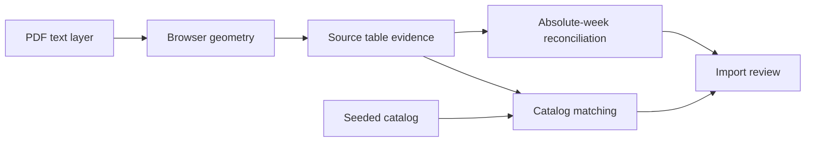

# Requirements

### Overview & Goals

Fix the supplied Push/Pull/Legs PDF import so that:

- Adjacent exercise rows are not fused into invalid names.
- Valid movements map to the global exercise library automatically.
- Genuinely missing movements are added through the idempotent catalog seed.
- Repeated local week cycles in later schedule sections become distinct sequential program weeks instead of collapsing the import to six weeks or overloading weeks 2–4, without deleting days or relaxing the seven-day limit.
- Explicit RPE/RIR data is recovered, while genuinely absent RPE remains unspecified and non-blocking.

### Scope

#### In Scope

- Browser-side PDF table-row reconstruction.
- Source-evidence reconciliation for exercise names and RPE/RIR.
- Deterministic normalization of ordered outline chunk ranges and extracted local week labels into absolute program weeks.
- Catalog aliases and new seed entries based only on corrected source rows.
- Regression coverage and implemented-feature documentation.

#### Out of Scope

- Fuzzy matching of malformed concatenated names.
- Inventing RPE targets when the PDF provides neither RPE nor convertible RIR.
- Weakening the seven-days-per-week constraint.
- Storing or uploading PDF bytes or page images.

### Acceptance Criteria

- Every printed exercise row is represented once; neighboring movements are not concatenated.
- No concatenated string is seeded as an exercise or alias.
- Every corrected valid movement resolves uniquely; only genuine placeholders or source ambiguities remain unresolved.
- Missing movements are seeded by stable slug, and re-seeding does not duplicate rows.
- Every sequential schedule cycle represented by the PDF becomes its own contiguous absolute week range; the import is not truncated or collapsed to the first six local labels.
- Every absolute week contains at most seven days, including the currently overloaded weeks 2–4, with all source-backed days preserved in page and schedule order.
- Already-correct absolute weeks and same-week page splits remain unchanged; ambiguous parallel schedules remain reviewable rather than silently renumbered.
- Explicit RPE and valid RIR are recovered with existing provenance semantics; source-silent values remain null.
- The resulting draft has no false mapping or week-overflow blocker and can be created once genuine ambiguities are resolved.

# Technical Design

### Current Implementation

- [pdfText.ts](air-file://hr6an1v8utsqe8dv3q4m/D:/App/WorkoutApp/web/src/lib/pdfText.ts?type=file&root=C%3A) reconstructs page text locally, using row geometry from [pdfGeometry.ts](air-file://hr6an1v8utsqe8dv3q4m/D:/App/WorkoutApp/web/src/lib/pdfGeometry.ts?type=file&root=C%3A) and columns from [pdfHeaderColumns.ts](air-file://hr6an1v8utsqe8dv3q4m/D:/App/WorkoutApp/web/src/lib/pdfHeaderColumns.ts?type=file&root=C%3A). The fused names originate before catalog matching.
- [ImportTableEvidence.cs](air-file://hr6an1v8utsqe8dv3q4m/D:/App/WorkoutApp/api/Services/ImportTableEvidence.cs?type=file&root=C%3A) already restores names and prescriptions from uniquely matched source rows. It should remain authoritative and conservative.
- [ImportOutlineEvidence.cs](air-file://hr6an1v8utsqe8dv3q4m/D:/App/WorkoutApp/api/Services/ImportOutlineEvidence.cs?type=file&root=C%3A) preserves model-proposed `WeekFrom`/`WeekTo` values and merges overlapping page intervals, but it does not distinguish a later structural run that restarts local weeks 1–6 from a same-week page split.
- [ImportValidation.cs](air-file://hr6an1v8utsqe8dv3q4m/D:/App/WorkoutApp/api/Services/ImportValidation.cs?type=file&root=C%3A) permits overlapping week ranges when their pages are disjoint, which is valid for split/parallel tables but also lets sequential local-week cycles reach extraction unchanged.
- [ImportChunkReconciliation.cs](air-file://hr6an1v8utsqe8dv3q4m/D:/App/WorkoutApp/api/Services/ImportChunkReconciliation.cs?type=file&root=C%3A) shapes and de-duplicates extracted days before doing anything with the chunk bounds; it only warns when a day falls outside the range. If both outline and content use local weeks 1–6, later cycles therefore merge into those same six stored weeks and overload weeks 2–4.
- [ImportExtraction.cs](air-file://hr6an1v8utsqe8dv3q4m/D:/App/WorkoutApp/api/Services/ImportExtraction.cs?type=file&root=C%3A) persists normalized chunks for direct and selected-alternative imports, while [ImportExtraction.Execution.cs](air-file://hr6an1v8utsqe8dv3q4m/D:/App/WorkoutApp/api/Services/ImportExtraction.Execution.cs?type=file&root=C%3A) gives each extraction pass an absolute chunk directive. Both paths need the same corrected ranges before reads begin.
- [ImportValidation.cs](air-file://hr6an1v8utsqe8dv3q4m/D:/App/WorkoutApp/api/Services/ImportValidation.cs?type=file&root=C%3A) correctly checks the seven-day absolute-week limit and intentionally treats unspecified RPE as a warning.
- [CatalogSeed.cs](air-file://hr6an1v8utsqe8dv3q4m/D:/App/WorkoutApp/api/Services/CatalogSeed.cs?type=file&root=C%3A) transactionally upserts exercises by slug and replaces aliases. [exercises.json](air-file://hr6an1v8utsqe8dv3q4m/D:/App/WorkoutApp/deploy/exercises.json?type=file&root=C%3A) is authoritative.

### Key Decisions

- Use source-first correction rather than broadening fuzzy catalog matching.
- Normalize weeks at two boundaries: first convert provably sequential outline runs into non-overlapping absolute chunk ranges, then translate each chunk’s extracted local labels into that stored range before shaping, duplicate detection, and merge.
- Treat a later non-overlapping page run as a new week cycle only when page order plus an explicit block/phase boundary or monotonic schedule-run evidence proves succession. Preserve same-structure overlapping ranges as page splits/parallel schedules, and warn instead of guessing when evidence is ambiguous.
- Preserve the PDF’s local ordinal in `PhaseWeek`; only `DraftWorkout.Week` becomes the absolute program week.
- Add an alias only for the same movement. Seed a new row only for a distinct, source-verified movement absent from the library.
- Recover RPE only from explicit RPE cells or valid RIR using the existing `10 - RIR` rule.

### Proposed Changes

- Refine row/baseline grouping in [pdfGeometry.ts](air-file://hr6an1v8utsqe8dv3q4m/D:/App/WorkoutApp/web/src/lib/pdfGeometry.ts?type=file&root=C%3A) and row rendering in [pdfHeaderColumns.ts](air-file://hr6an1v8utsqe8dv3q4m/D:/App/WorkoutApp/web/src/lib/pdfHeaderColumns.ts?type=file&root=C%3A), preserving rotated text, multiline headers, tracking tables, and day labels.
- Strengthen one-to-one row assignment in [ImportTableEvidence.cs](air-file://hr6an1v8utsqe8dv3q4m/D:/App/WorkoutApp/api/Services/ImportTableEvidence.cs?type=file&root=C%3A) without accepting fused names or inventing prescriptions.
- Create [ImportAbsoluteWeeks.cs](air-file://hr6an1v8utsqe8dv3q4m/D:/App/WorkoutApp/api/Services/ImportAbsoluteWeeks.cs?type=file&root=C%3A) as a focused pure reconciler with separate operations for ordered outline chunks and extracted days.
- In [ImportExtraction.cs](air-file://hr6an1v8utsqe8dv3q4m/D:/App/WorkoutApp/api/Services/ImportExtraction.cs?type=file&root=C%3A), normalize each routine’s chunks after source-label/block-run reconciliation and before `SplitChunks`, for both immediate extraction and alternative selection.
- In [ImportChunkReconciliation.cs](air-file://hr6an1v8utsqe8dv3q4m/D:/App/WorkoutApp/api/Services/ImportChunkReconciliation.cs?type=file&root=C%3A), translate local day weeks against the corrected chunk range before `ImportDayShape.Reconcile`, duplicate keys, coverage checks, and final merge.
- Clarify absolute-versus-local week expectations in [WorkoutAiSchemas.cs](air-file://hr6an1v8utsqe8dv3q4m/D:/App/WorkoutApp/api/Services/WorkoutAiSchemas.cs?type=file&root=C%3A) and update the import compatibility version in [WorkoutAi.cs](air-file://hr6an1v8utsqe8dv3q4m/D:/App/WorkoutApp/api/Services/WorkoutAi.cs?type=file&root=C%3A) so stale six-week partial results cannot mix with the new contract.
- Add verified aliases/new entries to [exercises.json](air-file://hr6an1v8utsqe8dv3q4m/D:/App/WorkoutApp/deploy/exercises.json?type=file&root=C%3A).
- Update the existing import feature bullet in [CLAUDE.md](air-file://hr6an1v8utsqe8dv3q4m/D:/App/WorkoutApp/CLAUDE.md?type=file&root=C%3A), then synchronize [AGENTS.md](air-file://hr6an1v8utsqe8dv3q4m/D:/App/WorkoutApp/AGENTS.md?type=file&root=C%3A) byte-identically.

### Risks

- **Other PDF layouts regress:** constrain geometry changes with existing and new coordinate fixtures.
- **Page splits or parallel routines are mistaken for later cycles:** require ordered, non-overlapping pages and structural/run-boundary evidence; preserve overlapping same-structure ranges and surface ambiguity instead of offsetting them.
- **Outline and content use different week conventions:** normalize the outline first, then map content by relative distinct-week position within each chunk rather than trusting raw equality.
- **Catalog pollution:** accept only source-restored names and enforce global alias uniqueness.
- **RPE fabrication:** preserve null unless explicit evidence exists.
- **Concurrent edits:** inspect target diffs before changes and avoid resetting unrelated work.

# Testing

### Test Changes

- Extend [pdfGeometry.test.ts](air-file://hr6an1v8utsqe8dv3q4m/D:/App/WorkoutApp/web/src/lib/pdfGeometry.test.ts?type=file&root=C%3A), [pdfHeaderColumns.test.ts](air-file://hr6an1v8utsqe8dv3q4m/D:/App/WorkoutApp/web/src/lib/pdfHeaderColumns.test.ts?type=file&root=C%3A), and [pdfText.test.ts](air-file://hr6an1v8utsqe8dv3q4m/D:/App/WorkoutApp/web/src/lib/pdfText.test.ts?type=file&root=C%3A) with reduced coordinate fixtures for adjacent names, split labels, degree text, and rotated text.
- Extend [ImportTableEvidenceTests.cs](air-file://hr6an1v8utsqe8dv3q4m/D:/App/WorkoutApp/tests/ImportTableEvidenceTests.cs?type=file&root=C%3A) for exact source-name restoration, fused-name prevention, explicit RPE/RIR recovery, and absent-RPE preservation.
- Create [ImportAbsoluteWeekTests.cs](air-file://hr6an1v8utsqe8dv3q4m/D:/App/WorkoutApp/tests/ImportAbsoluteWeekTests.cs?type=file&root=C%3A) for repeated 1–6 outline cycles, the observed weeks 2–4 overload shape, chunk-relative day translation, already-absolute ranges, same-week page splits, and ambiguous/parallel schedules.
- Retain [ImportPhaseWeekTests.cs](air-file://hr6an1v8utsqe8dv3q4m/D:/App/WorkoutApp/tests/ImportPhaseWeekTests.cs?type=file&root=C%3A) for the distinct responsibility of numbering `PhaseWeek` from one without changing absolute `Week`.
- Extend [CatalogCoverageTests.cs](air-file://hr6an1v8utsqe8dv3q4m/D:/App/WorkoutApp/tests/CatalogCoverageTests.cs?type=file&root=C%3A) so every corrected name maps to its expected canonical movement and aliases/slugs remain unique.

### Verification

- Run `dotnet test tests/Workout.Tests.csproj` from the repository root.
- From the web workspace, run `npm.cmd run check:docs`, `npm.cmd run check:standards`, `npm.cmd run typecheck`, `npm.cmd test`, and `npm.cmd run build`.
- Run `node scripts/sync-docs.mjs`, followed by `node scripts/sync-docs.mjs --check`.
- Run `git diff --check`.
- Import the supplied PDF against the disposable browser-test API/database and verify that all schedule cycles are present beyond local week 6, weeks 2–4 and every later week contain no more than seven days, corrected names map, RPE warnings remain source-faithful, source-page navigation works, and program creation is available. Report live-provider or credential-dependent checks separately if unavailable.

# Delivery Steps

###   Step 1: Repair PDF table-row reconstruction
Affected PDF tables produce one source row per printed exercise without regressing existing layouts.

- Add reduced coordinate fixtures to the PDF geometry, header-column, and page-text tests.
- Refine baseline grouping in [pdfGeometry.ts](air-file://hr6an1v8utsqe8dv3q4m/D:/App/WorkoutApp/web/src/lib/pdfGeometry.ts?type=file&root=C%3A).
- Adjust column-aware row rendering in [pdfHeaderColumns.ts](air-file://hr6an1v8utsqe8dv3q4m/D:/App/WorkoutApp/web/src/lib/pdfHeaderColumns.ts?type=file&root=C%3A).
- Preserve rotated text, multiline headers, tracking tables, and source day labels.

###   Step 2: Normalize sequential outline week cycles
Every source-proven schedule cycle receives a distinct absolute chunk range before extraction, so later local weeks 1–6 cannot collapse into the first six program weeks.

- Add the focused [ImportAbsoluteWeeks.cs](air-file://hr6an1v8utsqe8dv3q4m/D:/App/WorkoutApp/api/Services/ImportAbsoluteWeeks.cs?type=file&root=C%3A) reconciler for ordered chunk runs.
- Apply it in [ImportExtraction.cs](air-file://hr6an1v8utsqe8dv3q4m/D:/App/WorkoutApp/api/Services/ImportExtraction.cs?type=file&root=C%3A) to direct and selected-alternative paths after source/block reconciliation and before section splitting.
- Preserve same-week page splits and parallel schedules; emit a targeted notice when succession cannot be proven.
- Cover repeated 1–6 cycles, already-absolute ranges, and ambiguous overlaps in [ImportAbsoluteWeekTests.cs](air-file://hr6an1v8utsqe8dv3q4m/D:/App/WorkoutApp/tests/ImportAbsoluteWeekTests.cs?type=file&root=C%3A).

###   Step 3: Translate chunk days and reconcile source evidence
Extracted days land in their chunk’s absolute weeks before shaping and merging, while authoritative names and prescriptions remain source-backed.

- Translate relative local day labels in [ImportChunkReconciliation.cs](air-file://hr6an1v8utsqe8dv3q4m/D:/App/WorkoutApp/api/Services/ImportChunkReconciliation.cs?type=file&root=C%3A) before day shaping, duplicate detection, and coverage checks.
- Preserve `PhaseWeek` as the local phase ordinal and keep existing phase-week normalization separate.
- Strengthen one-to-one source-row assignment in [ImportTableEvidence.cs](air-file://hr6an1v8utsqe8dv3q4m/D:/App/WorkoutApp/api/Services/ImportTableEvidence.cs?type=file&root=C%3A).
- Add a regression matching the observed six-week collapse and overloaded weeks 2–4, asserting every resulting week has at most seven days.
- Verify explicit RPE/RIR recovery and null preservation where the source is silent.

###   Step 4: Curate catalog mappings and seed missing exercises
Every verified movement resolves uniquely without accepting malformed compound names.

- Run corrected source names through existing catalog normalization.
- Add exact aliases for alternate spellings of existing movements.
- Add stable seed rows only for distinct missing exercises, including complete muscle/equipment/load metadata.
- Extend shipped-catalog coverage and uniqueness tests.
- Verify repeated seeding updates rather than duplicates rows.

###   Step 5: Integrate, document, and verify the import
The complete PDF import passes creation blockers while preserving source-faithful warnings and repository standards.

- Clarify absolute/local week semantics in the model contract and bump the import compatibility version to prevent continuation with stale six-week partial results.
- Update [CLAUDE.md](air-file://hr6an1v8utsqe8dv3q4m/D:/App/WorkoutApp/CLAUDE.md?type=file&root=C%3A) and synchronize [AGENTS.md](air-file://hr6an1v8utsqe8dv3q4m/D:/App/WorkoutApp/AGENTS.md?type=file&root=C%3A).
- Run API, frontend, build, standards, documentation-equality, and diff checks.
- Re-import the supplied PDF against disposable infrastructure and verify all schedule cycles extend beyond local week 6, no week exceeds seven days, names map, RPE warnings remain accurate, and the final creation gate opens.